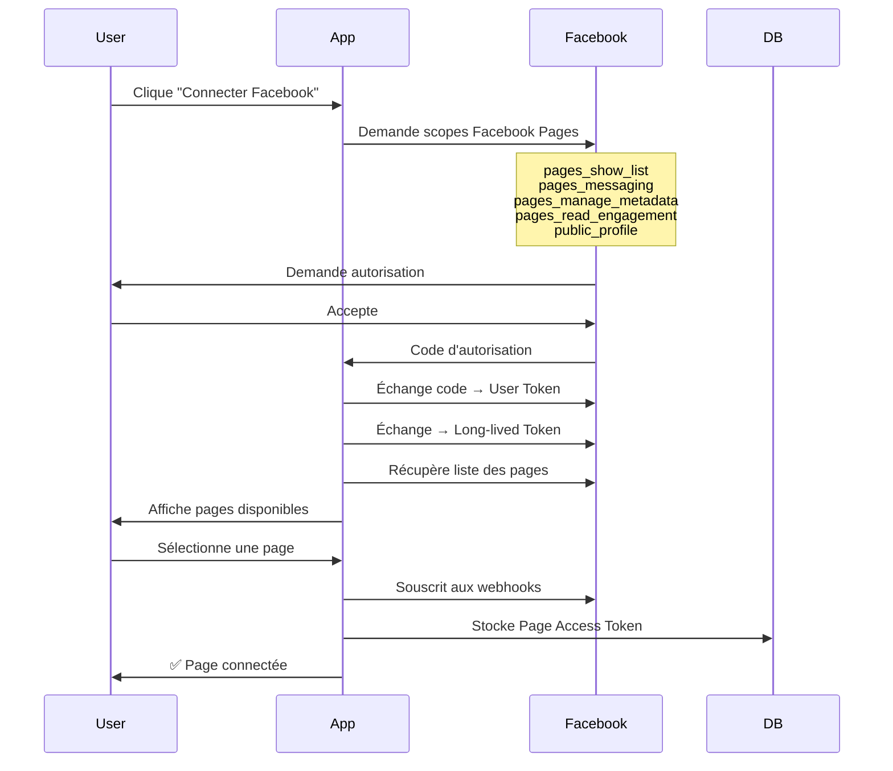

# 🧹 Nettoyage des scopes Facebook - Retrait Instagram & WhatsApp

## 📋 Résumé des modifications

Les connexions Instagram et WhatsApp sont gérées séparément. Ce processus ne gère maintenant **que la connexion des Pages Facebook** pour Messenger.

---

## ✅ Scopes Facebook mis à jour

### Avant (tous les scopes)
```typescript
scope: 'pages_show_list,pages_messaging,business_management,pages_read_engagement,pages_manage_posts,public_profile,instagram_basic,instagram_manage_messages,instagram_content_publish,whatsapp_business_management,whatsapp_business_messaging'
```

### Après (Facebook Pages uniquement)
```typescript
scope: 'pages_show_list,pages_messaging,pages_manage_metadata,pages_read_engagement,public_profile'
```

---

## 🔑 Détail des scopes conservés

| Scope | Description | Nécessaire pour |
|-------|-------------|-----------------|
| **pages_show_list** | Lister les pages de l'utilisateur | Afficher les pages disponibles |
| **pages_messaging** | Envoyer/recevoir des messages | Messagerie Facebook Messenger |
| **pages_manage_metadata** | Gérer les métadonnées de la page | Souscrire aux webhooks |
| **pages_read_engagement** | Lire les interactions | Lire les messages et profils |
| **public_profile** | Profil public de l'utilisateur | Authentification de base |

---

## 🗑️ Scopes retirés

### Instagram (géré ailleurs)
- ❌ `instagram_basic` - Infos de base Instagram
- ❌ `instagram_manage_messages` - Gérer les messages Instagram
- ❌ `instagram_content_publish` - Publier du contenu Instagram

### WhatsApp (géré ailleurs)
- ❌ `whatsapp_business_management` - Gérer WhatsApp Business
- ❌ `whatsapp_business_messaging` - Envoyer des messages WhatsApp

### Autres
- ❌ `business_management` - Non nécessaire pour Pages uniquement
- ❌ `pages_manage_posts` - Remplacé par pages_manage_metadata

---

## 📁 Fichiers modifiés

### 1. `/src/app/api/auth/start/meta/route.ts`

**Changements** :
- ✅ Scopes mis à jour (ligne 28)
- ✅ BaseUrl corrigé vers `https://xamxam.io`

```typescript
// Avant
scope: 'pages_show_list,pages_messaging,business_management,...'

// Après
scope: 'pages_show_list,pages_messaging,pages_manage_metadata,pages_read_engagement,public_profile'
```

---

### 2. `/src/app/api/auth/callback/meta/route.ts`

**Changements** :
- ✅ Interface `MetaPage` nettoyée (lignes 17-23)
- ✅ Champs Instagram retirés de la requête API (ligne 131)
- ✅ BaseUrl corrigé vers `https://xamxam.io`

```typescript
// Avant
interface MetaPage {
  id: string;
  name: string;
  access_token: string;
  category: string;
  tasks: string[];
  instagram_business_account?: {  // ❌ Retiré
    id: string;
    username: string;
    profile_picture_url: string;
  };
}

// Après
interface MetaPage {
  id: string;
  name: string;
  access_token: string;
  category: string;
  tasks: string[];
}
```

```typescript
// Avant
pagesUrl.searchParams.append('fields', 'id,name,access_token,category,tasks,instagram_business_account{id,username,profile_picture_url}');

// Après
pagesUrl.searchParams.append('fields', 'id,name,access_token,category,tasks');
```

---

### 3. `/src/app/api/channels/finalize/route.ts`

**Changements** :
- ✅ Interface `FacebookPage` nettoyée (lignes 16-22)
- ✅ Commentaires Instagram retirés (ligne 70-72)
- ✅ Logique conditionnelle Instagram/Facebook simplifiée (lignes 106-109)
- ✅ Message d'erreur de permission simplifié (ligne 89)

```typescript
// Avant
if (platform === 'instagram') {
  channelType = ChannelType.INSTAGRAM_DM;
  if (!selectedPage.instagram_business_account) {
    throw new Error('No Instagram Business account linked to this page.');
  }
  externalId = selectedPage.instagram_business_account.id;
} else {
  channelType = ChannelType.FACEBOOK_PAGE;
  externalId = pageId;
}

// Après
// On ne gère que Facebook Pages ici, Instagram et WhatsApp sont gérés ailleurs
const channelType: ChannelType = ChannelType.FACEBOOK_PAGE;
const externalId: string = pageId;
```

---

## 🔄 Flux de connexion simplifié



---

## 🧪 Tests à effectuer

### 1. Test de connexion
```bash
# Démarrer le processus de connexion
curl https://xamxam.io/api/auth/start/meta
```

**Résultat attendu** :
```json
{
  "url": "https://www.facebook.com/v23.0/dialog/oauth?client_id=...&scope=pages_show_list,pages_messaging,pages_manage_metadata,pages_read_engagement,public_profile",
  "csrfToken": "..."
}
```

### 2. Test de callback
Après autorisation Facebook, vérifier que :
- ✅ Les pages sont récupérées sans erreur
- ✅ Aucun champ `instagram_business_account` n'est présent
- ✅ Le token est stocké correctement

### 3. Test de finalisation
```bash
curl -X POST https://xamxam.io/api/channels/finalize \
  -H "Content-Type: application/json" \
  -d '{
    "pageId": "123456789",
    "pageName": "Ma Page Test",
    "platform": "facebook"
  }'
```

**Résultat attendu** :
```json
{
  "success": true
}
```

### 4. Vérifier dans la DB
```sql
SELECT * FROM "Channel" 
WHERE type = 'FACEBOOK_PAGE' 
ORDER BY "createdAt" DESC 
LIMIT 1;
```

**Champs attendus** :
- ✅ `type` = `FACEBOOK_PAGE`
- ✅ `externalId` = ID de la page Facebook
- ✅ `accessToken` = Token chiffré
- ✅ `isActive` = `true`

---

## ⚠️ Points d'attention

### 1. Instagram et WhatsApp
Ces plateformes sont maintenant gérées **séparément** :
- Instagram : Processus de connexion dédié (à implémenter)
- WhatsApp : Processus de connexion dédié (déjà implémenté avec Evolution API)

### 2. Permissions Facebook
Pour que l'app fonctionne en production, il faut :
1. Soumettre l'app à Facebook pour review
2. Demander **Advanced Access** pour :
   - `pages_messaging`
   - `pages_manage_metadata`
   - `pages_read_engagement`

### 3. Webhooks
Les webhooks sont maintenant configurés uniquement pour :
- `messages` - Messages entrants
- `messaging_postbacks` - Boutons et actions

---

## 📚 Références

### Documentation Meta
- [Permissions Reference](https://developers.facebook.com/docs/permissions)
- [Pages Messaging Permission](https://developers.facebook.com/docs/permissions/reference/pages_messaging/)
- [Pages Manage Metadata](https://developers.facebook.com/docs/permissions/reference/pages_manage_metadata/)
- [Messenger Platform](https://developers.facebook.com/docs/messenger-platform)

### Exemples d'implémentation
- [Chatwoot Facebook Setup](https://developers.chatwoot.com/self-hosted/configuration/features/integrations/facebook-channel-setup)
- [Stack Overflow - Facebook Messenger API](https://stackoverflow.com/questions/64562634/facebook-api-how-to-get-scope-pages-manage-metadata)

---

## ✅ Checklist de déploiement

- [x] Scopes mis à jour dans `/api/auth/start/meta`
- [x] Interface `MetaPage` nettoyée dans callback
- [x] Champs API nettoyés (pas de champs Instagram)
- [x] Interface `FacebookPage` nettoyée dans finalize
- [x] Logique conditionnelle Instagram retirée
- [x] Commentaires mis à jour
- [x] BaseUrl corrigé vers production
- [ ] Tests en local effectués
- [ ] Tests en staging effectués
- [ ] Déployé en production
- [ ] Vérifié que les pages se connectent correctement
- [ ] Vérifié que les messages sont reçus

---

**Date** : 16 Octobre 2025  
**Type** : Nettoyage et simplification  
**Impact** : Facebook Pages uniquement (Instagram et WhatsApp gérés ailleurs)  
**Status** : ✅ Implémenté - En attente de tests
